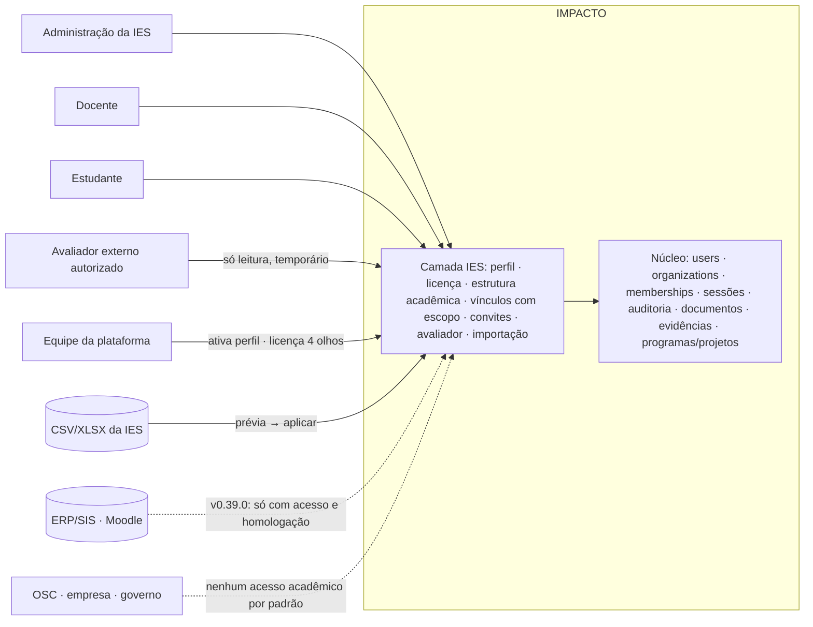
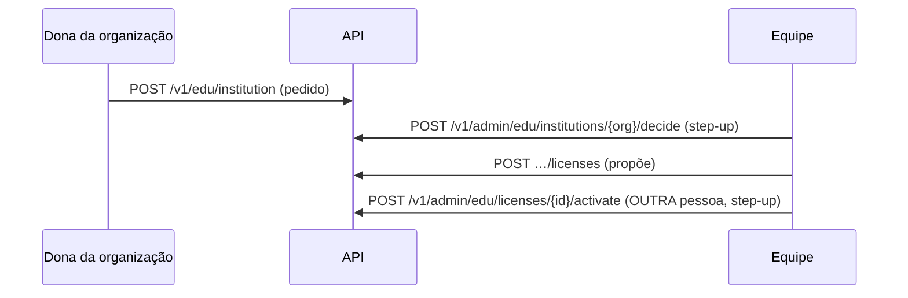

# Arquitetura da camada IES (Etapa 3)

## 1. Contexto



## 2. Componentes (padrões reais do repositório)

| Camada | Arquivo | Responsabilidade |
|---|---|---|
| Banco | `backend/migrations/0075_v0360_education_foundation.sql` | tabelas, funções de acesso, RLS, gatilhos, GRANTs, retenção, auditoria |
| Serviço | `backend/impacto/education/` (`access.py`, `institutions.py`, `structure.py`, `people.py`, `imports.py`, `exports.py`) | regras de negócio; autorização explícita (porta) antes de cada operação, além da RLS (muro) |
| Rotas | `backend/impacto/api/education_routes.py` (pessoas) e `education_admin_routes.py` (equipe) | `@route`; `auth="user"` para a área acadêmica (com ou sem organização ativa); `auth="org", min_role="owner"` para o pedido do perfil; `auth="admin"` + `permission` para a equipe |
| Contexto | `api/access_routes.py::dashboard_for` + `GET /v1/edu/me` | encaminha quem só tem vínculo acadêmico para `/ensino`; lista contextos reconferidos no servidor |
| Interface | `web/src/pages/education.tsx` (+ rotas em `web/src/app.tsx`) | área `/ensino`, telas da IES, docente, estudante, avaliador, convite, equipe |
| Rotina | `impacto/jobs.py::edu_retention` | apaga os dados das linhas de prévia vencidas; marca convites/concessões vencidos |
| Exportação | `impacto/education/exports.py::safe_cell` | **uma** função de neutralização de fórmula, testada (BASELINE §4) |

**Por que um pacote `education/`:** as regras acadêmicas (escopo, assento, importação) são um domínio novo; colocá-las nos serviços
existentes misturaria responsabilidades. O pacote **usa** o núcleo (identidade, auditoria, leitor de planilha, redator de log) e não o
reescreve.

## 3. Fluxos principais



```mermaid
sequenceDiagram
  participant Gestão
  participant API
  participant Banco
  Gestão->>API: POST …/imports (arquivo + entidade)
  API->>API: tamanho · tipo · antivírus · leitor seguro · validação por linha
  API->>Banco: grava SÓ a prévia (linhas normalizadas)
  Gestão->>API: POST …/imports/{id}/apply
  API->>Banco: transação única: cria/atualiza; conflitos ficam; pessoas → roteiro + convite
```

```mermaid
sequenceDiagram
  participant Pessoa
  participant API
  participant Banco
  Pessoa->>API: POST /v1/edu/invitations/accept {token} (logada)
  API->>Banco: edu_accept_invitation(hash) — confere validade, uso, revogação, e-mail confirmado
  Banco-->>API: vínculos ativados; assento alocado ou "aguardando assento"
```

## 4. Contratos de API (v0.36.0)

Prefixo `/v1/edu`. Erros no padrão da casa (`{error, message, details}`); IDs são UUID; datas ISO-8601; paginação `limit/offset`
onde houver lista. Lista completa e classe de autorização de cada rota em `ROUTE_MAP_IES.md` e na matriz gerada
(`docs/execution/API_AUTHORIZATION_MATRIX.csv`).

## 5. Estratégia de liberação e compatibilidade

- Nada muda para quem não usa a camada: rotas novas, tabelas novas, telas novas. O único ponto compartilhado alterado é o
  encaminhamento depois do login (só para quem tem vínculo acadêmico e não tem organização — hoje essas pessoas não existem).
- A camada só "acende" para uma organização depois da ativação pela equipe (perfil `active`): é o interruptor por cliente.
- Interruptor de emergência existente (`mutations`) também cobre as rotas novas.

## 6. Plano de testes por camada

| Camada | O quê | Onde |
|---|---|---|
| Banco | CHECKs, FKs compostas, gatilhos (escopo da mesma IES, sem autoalteração, só inclusão), RLS com contexto de outra IES (0 linhas) | `tests/test_v0360_education.py` |
| Serviço/API | cada critério AC-01…AC-18 com caso positivo e negativo; convites (5 casos); assentos; vencimento; importação (prévia, inválida, idempotência, conflito, cancelamento); exportação neutralizada | `tests/test_v0360_education.py` |
| Interface | jornadas no Chromium: administração importa e convida; estudante aceita e vê só a turma; docente; avaliador; `A11Y_JS` em todas as telas novas | `tests/test_e2e_v0360_education.py` |
| Regressão | suíte completa + pilha do zero + matrizes geradas | CI do PR + log local |

## 7. Matriz de risco

| Risco | Prob. | Impacto | Mitigação | Teste |
|---|---|---|---|---|
| Estudante enxerga dados da organização IES | média se mal desenhado | alto | D-02: estudante não é membro | AC-04 |
| IES A lê IES B (troca de ID) | média | alto | porta + muro; FKs compostas | AC-01 |
| Autoelevação de papel | baixa | alto | gatilho + esquema sem campos de papel no corpo | AC-08 |
| Importação parcial por erro | média | médio | prévia sem escrita; aplicar em uma transação | AC-10 |
| Dado pessoal guardado sem prazo na prévia | alta sem rotina | médio | `purge_after` + `edu_retention` | teste da rotina |
| Licença vira cobrança disfarçada | baixa | alto | sem coluna de valor; ADR-341 | revisão + teste de esquema |
| Rótulo "MEC" | baixa | alto | D-08; varredura de textos | AC-18 |
| Regressão no login de quem já usa | baixa | alto | mudança só no ramo "sem organização + vínculo acadêmico" | suíte completa |

## 8. Reversão

Código: voltar o deploy anterior (o código anterior ignora as tabelas novas). Banco: a 0075 só acrescenta e não é desfeita. Dados
acadêmicos criados no demo podem ser descartados com o reseed do demo; na produção nada é criado sem a ativação manual pela equipe.
