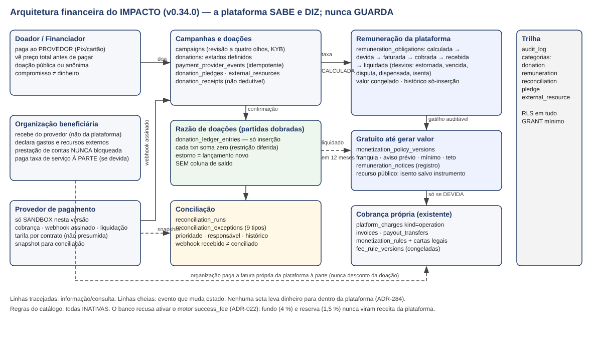
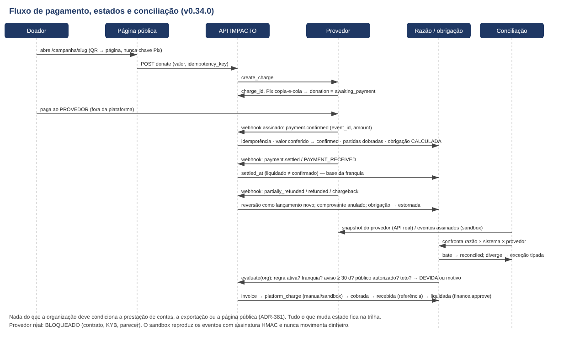

# Arquitetura financeira e fluxos (v0.34.0)

**Leitura do diagrama.** O dinheiro vai do doador/financiador ao provedor de pagamento e do provedor ao beneficiário. A plataforma
está no meio da **informação**, não do dinheiro: cria a cobrança, recebe o evento assinado, lança no razão, calcula a taxa, abre a
obrigação, concilia e presta contas. A única cobrança que a plataforma emite é a dela própria (`platform_charges`), à parte.

Camadas (todas com RLS e GRANT mínimo ao `impacto_app`):

1. **Campanhas e doações** — revisão a quatro olhos, KYB do beneficiário, estados definidos, eventos idempotentes, comprovante.
2. **Razão de doações** — partidas dobradas, só inserção, soma zero por transação, sem coluna de saldo.
3. **Conciliação** — execuções e exceções tipadas com prioridade, responsável e histórico.
4. **Remuneração** — obrigações com a cadeia calculada → devida → faturada → cobrada → recebida → liquidada; política
   "gratuito até gerar valor" versionada; avisos registrados; recurso público isento salvo instrumento.
5. **Cobrança própria (existente)** — `platform_charges`, `invoices`, instruções de repasse, catálogo de regras e cartas legais.
6. **Trilha** — `audit_log` por categoria e históricos só-inserção.

**Leitura do fluxo.** (1) O QR leva à página, nunca a uma chave Pix. (2) `donate` cria a cobrança e devolve o código; a doação
fica `awaiting_payment` — pendente não é arrecadação. (3) O doador paga ao provedor. (4) O webhook assinado confirma: idempotência,
valor conferido, partidas dobradas, obrigação **calculada**. (5) Liquidação é evento separado (`settled_at`) e é a base da franquia.
(6) Estorno parcial/total e chargeback são lançamentos novos; o comprovante é anulado; a obrigação vira estornada (ou disputa, se já
recebida). (7) A conciliação confronta razão × sistema × snapshot do provedor; só o que bate vira `reconciled`; o resto vira exceção.
(8) `evaluate` aplica as cinco condições do gatilho; só então fatura própria → cobrada → recebida → liquidada (segregado).

Fontes SVG editáveis: `diagramas/arquitetura_financeira.svg`, `diagramas/fluxo_pagamento_conciliacao.svg`.

Documentos irmãos: `FREE_UNTIL_VALUE_POLICY.md`, `LEDGER_AND_FINANCIAL_STATES.md`, `MONETIZATION_MATRIX.md`, `RISK_MATRIX.md`,
`LEGAL_FISCAL_MATRIX.md`, `DONATIONS_API.md`, `TEST_SCENARIO_COVERAGE.md`, `MODULE_INVENTORY.md`,
`PUBLICATION_ROLLBACK_CHECKLIST.md`, `modelo_24m/MODELO_24M_v0340.md`, e os da v0.33.0 em `docs/donations/`.
