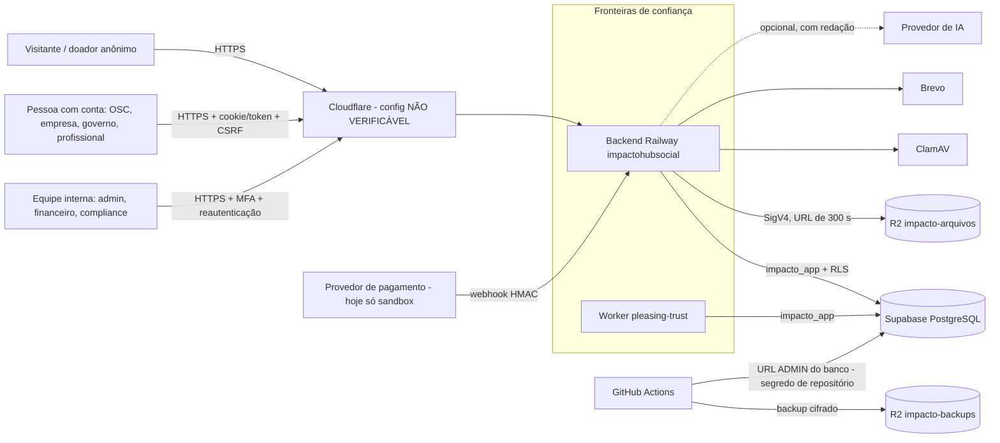

# Auditoria de segurança e integridade financeira — Fase 1 (somente leitura)

**Pacote seguido:** IMPACTO MASTER Security & Financial Integrity 1.0.0 (16 arquivos; SHA-256 de todos conferidos contra o
`MANIFEST.json` do pacote). **Data:** 10/10/2026. **Modo:** somente leitura — nenhum arquivo do repositório foi alterado,
nenhuma configuração mexida, nenhuma conexão com a produção além de duas leituras públicas de `/healthz`.

> Este documento **não** é certificação, pentest nem parecer jurídico. "COMPROVADO" quer dizer: há implementação e um teste
> (ou configuração observada) que a exercita **no escopo analisado** — não quer dizer "impossível de invadir".

---

## 0. Em linguagem simples

O sistema tem uma base de segurança forte e testada: cada organização só enxerga os próprios dados (o banco reforça isso),
a área administrativa exige segundo fator, senhas são guardadas do jeito certo, os registros de auditoria e o razão
financeiro não podem ser apagados, e 471 testes de segurança já existentes passaram aqui.

Mas a auditoria achou **falhas reais**, três delas provadas por teste nesta fase:

1. **Financiador vê documentos privados da OSC.** Quando uma empresa entra em "diligência" com uma OSC, ela passa a ver e
   baixar documentos privados da OSC que não são de projeto — inclusive a **exportação de dados** que a OSC gerou na
   plataforma — e continua vendo mesmo depois de a candidatura ser encerrada. **Provado:** antes da diligência 404, depois
   200, e os documentos aparecem listados na tela da candidatura.
2. **Qualquer membro "autoriza cobrança".** Três rotas comerciais (aceitar oferta com autorização de cobrança, revogar a
   autorização, mudar o teto de gasto) aceitam qualquer membro da organização, até quem só tem leitura.
3. **A conciliação compara o sistema com ele mesmo.** O estado "conciliado" hoje não prova nada: sem extrato do provedor, o
   sistema usa os próprios eventos como se fossem o extrato, e uma rota antiga marca tudo como conciliado.

E pendências que **só você** pode resolver, algumas sérias:

- **O repositório está PÚBLICO** (decisão registrada em 09/10 era torná-lo privado — a troca não foi feita).
- **O token do backup que apareceu no chat ainda não foi trocado** (item C2 da auditoria de 09/10).
- **Produção e demo rodam a versão 0.30.0** (lido em `/healthz` hoje). Nada da 0.31 à 0.34 está no ar — nem a proteção
  0071 da API pública do Supabase, se o "Deploy latest commit" não foi feito depois de 09/10.
- A `main` não tem proteção de branch, os segredos de produção do GitHub não estão em "environment" com aprovação, e os
  alertas do Dependabot estão desligados.

**Decisão preliminar (gate de produção): NO-GO** para receber dados reais ou dinheiro real. Isso **não** muda o que já
estava decidido (a produção só recebe dados reais depois da revisão jurídica) — e agora há também motivos técnicos.

O próximo passo depende de você: autorizar (ou não) a fase de correções numa branch separada (§9).

---

## 1. Escopo e commit analisado

| Item | Valor | Como foi confirmado |
|---|---|---|
| Repositório | `jciebres-eng/impactohubsocial` — **público** (`private: false`), forks permitidos | API do GitHub (`GET /repos/...`) |
| Código analisado | branch `ecossistema-v0340`, commit `16d837b` (árvore do pacote `44d6815`, v0.34.0); PRs #5 → #6 → #7 abertos | `git` local |
| `main` | `906d383` (v0.30.0 + v0.30.1 + rotinas de backup/monitor); 65 commits atrás do código analisado | `git` local |
| Produção | `https://www.impactohubsocial.com.br/healthz` → `{"status":"ok","version":"0.30.0","env":"production"}` | leitura pública, 10/10/2026 |
| Demo | `ideal-delight` → `{"status":"ok","version":"0.30.0","env":"development"}` | leitura pública, 10/10/2026 |
| CI do código analisado | execução `38056770514` (commit `16d837b`): auditoria, armazenamento, docker, backend (suíte completa) e pilha-do-zero **verdes** | API do GitHub |
| Suítes de segurança rodadas aqui | 23 módulos, **471 testes, 0 falha, 1 pulado** (protocolo S3, roda no CI), 113 s | `python3 -m unittest -v` (§8) |

**Consequência importante:** o que está no ar (0.30.0) é **mais antigo** que o código auditado. As falhas do código antigo
que já foram corrigidas na 0.31–0.34 continuam valendo na produção até a publicação; as falhas abaixo, em sua maioria,
existem nas duas versões.

**Sem acesso nesta fase (NÃO VERIFICÁVEL, §6):** painéis do Railway, Supabase e Cloudflare; banco de produção; logs dos
jobs do GitHub (o proxy daqui recusa); configurações de Actions, environments e alertas de segredo do GitHub.

---

## 2. Arquitetura e ativos observados

| Componente | Evidência | Observação |
|---|---|---|
| Backend Python (Starlette/uvicorn), autorização central em `impacto/http.py` (`@route` + `authorize()`) | `backend/impacto/http.py:237-261, 363-425` | 988 operações; 263 de administração |
| PostgreSQL com RLS por variável de sessão (`set_config('app.*')`) | `backend/impacto/db/pool.py:130-136`; `migrations/0002_security.sql:14-27` | 73 migrações · 370 `CREATE TABLE` · 779 políticas · 135 `SECURITY DEFINER` |
| Papel de execução `impacto_app` (sem BYPASSRLS, não dono das tabelas); migração como administrador | `backend/start_container.sh`, `start_worker.sh`, `impacto/app.py:66-79` | o boot recusa papel privilegiado em modo endurecido |
| Frontend React (esbuild) servido pelo backend | `web/src`, `Dockerfile` | CSP sem `unsafe-inline` |
| Worker de rotinas (`impacto.jobs loop`) | `backend/impacto/jobs.py` | Railway `pleasing-trust` (comando novo não confirmado) |
| Armazenamento: local (dev) / S3-R2 (produção), URLs assinadas de 300 s | `backend/impacto/adapters/storage.py` | buckets `impacto-arquivos`, `impacto-backups` (CLAUDE.md) |
| Antivírus ClamAV | `backend/impacto/adapters/antivirus.py` | serviço `clamav` no Railway (não testado lá) |
| E-mail SMTP (Brevo) | `backend/impacto/adapters/mail.py` | — |
| IA: provedor `local` por padrão; externo opcional com redação de dados pessoais | `backend/impacto/engines/ai/gateway.py` | sem ferramentas (tools) |
| Doações/remuneração/conciliação: **só provedor sandbox**, sem custódia | `services/donations.py`, `remuneration.py`, `reconciliation.py` | nenhuma regra de cobrança ativa |
| OIDC corporativo (opcional) | `services/oidc.py` | ativação em produção NÃO VERIFICÁVEL |
| CI/CD: 5 workflows na `main`, 6 no código analisado; deploy manual no Railway | `.github/workflows/`; CLAUDE.md | Actions não publicam nada |
| Integrações externas reais | `EXTERNAL_INTEGRATIONS.md` | KYC, provedor de pagamento, NFS-e, gov.br, ICP-Brasil: **BLOCKED_EXTERNAL_DEPENDENCY** |

**Dados pessoais e sensíveis observados:** e-mail, nome, CPF/CNPJ (organizações e pessoas físicas), documentos enviados
(estatutos, certidões, documentos de identidade para verificação), chave PIX de repasse (texto puro), segredo TOTP
(cifrado), dados de doadores (nome de exibição; CPF do pagador é descartado do webhook), conversas e rascunhos, prompts e
saídas de IA (só hash no registro de uso).

---

## 3. Matriz de controles

Estados: **COMPROVADO** · **PARCIAL** · **AUSENTE** · **NÃO VERIFICÁVEL**. Prioridade: P0 (antes de qualquer dado real ou
publicação), P1 (antes de dinheiro real / provedor real), P2 (próximo ciclo), P3 (melhoria). Responsável sugerido por papel:
**Dev** (código, feito por mim com sua autorização), **Você** (dono do produto, painéis), **Jur** (jurídico), **Cont**
(contábil), **DPO** (encarregado de dados). Testes citados: os 23 módulos rodados aqui (§8) ou a suíte completa do CI
`38056770514`.

### 3.1 Identidade, autenticação e sessões

| ID | Controle | Estado | Evidência | Risco / impacto | Correção | Prio | Critério de aceite | Resp. |
|---|---|---|---|---|---|---|---|---|
| AUTH-01 | Hash de senha e política | PARCIAL | scrypt N=2^17 (`security/passwords.py:15-35`), rehash, mínimo 10; `config.py:265` bloqueia N fraco em produção; `test_unit::test_password_hashing`, `test_api_auth::test_weak_password_and_invalid_cnpj_rejected` | lista de senhas comuns com 12 itens; sem checagem de senha vazada | lista offline grande (≥100 mil) | P2 | senha da lista recusada, teste | Dev |
| AUTH-02 | Limite de tentativas e bloqueio | PARCIAL | por IP (`services/ratelimit.py:33-42`) + por conta 8 falhas/15 min (`services/auth.py:21,246-253`); `test_api_auth::test_bruteforce_lockout`, `test_v0200_adversarial::...raises_429_at_the_declared_limit` | **IP vem do 1º valor do `X-Forwarded-For`** (`http.py:154-157`) e o uvicorn sobe com `--forwarded-allow-ips='*'` (`start_container.sh:44`): se a borda só acrescenta ao cabeçalho, o limite por IP é contornável; bloqueio por conta permite travar contas alheias | usar o IP da borda confiável (mais à direita / `CF-Connecting-IP` configurável); limitar proxies confiáveis | P1 | teste: `X-Forwarded-For` forjado não muda a chave do limite | Dev + Você (confirmar borda) |
| AUTH-03 | MFA obrigatório para equipe | PARCIAL | exigido no servidor em toda rota de administração (`http.py:400-401`); `test_security_tenancy::test_admin_without_mfa_is_blocked`, `test_v0120_hardening::test_admin_routes_require_mfa_even_for_platform_admin` | `REQUIRE_MFA_FOR_ADMINS=false` não é recusado em produção (`config.py:170`); equipe sem `is_platform_admin` pode desligar o MFA e a sessão continua "verificada" (`services/auth.py:508-523`) | recusar a variável falsa em produção; desligar MFA revoga as sessões e zera `mfa_verified` | P1 | testes negativos | Dev |
| AUTH-04 | Primeiro cadastro do MFA do administrador | PARCIAL | `mfa_enable` marca a sessão como verificada sem reautenticação (`services/auth.py:490-505`); `create-admin` em e-mail existente **promove a conta mantendo a senha antiga** (`cli.py:93-94`) | quem tiver a senha de um admin que ainda não ativou o MFA (ou tiver pré-cadastrado o e-mail dele) ativa o próprio TOTP e entra na área administrativa | `create-admin` recusa conta existente (ou força troca de senha e revoga sessões); MFA do admin ativado no primeiro acesso com prova de posse do e-mail | P1 | teste do CLI e do fluxo | Dev |
| AUTH-05 | Reautenticação (step-up) em ações sensíveis | PARCIAL | `core/access.py:47-69` (janela 900 s); `test_v0220_authorization::StepUpTests` | **103 rotas de escrita da administração não declaram permissão** e por isso não exigem reautenticação (ex.: mudar status de usuário, `admin_routes.py:125`; confirmar recebimento, `platform_routes.py:260`; decisão de identidade, `trust_routes.py:86`) | atribuir `permission=` a toda rota de escrita da administração; teste que reprova a falta | P1 | teste de varredura das rotas | Dev |
| AUTH-06 | Sessões (opacas, rotação, revogação, cookies) | COMPROVADO | tabela `sessions`, acesso 15 min, refresh 30 d, ociosidade 14 d, reuso revoga a família (`services/auth.py:63-96,360-405`); `test_api_auth::test_refresh_rotation_and_reuse_detection`, `::test_logout_revokes_session`, `test_v0230_session_hardening` | nenhum teste confere as flags dos cookies | teste das flags | P3 | teste | Dev |
| AUTH-07 | CSRF | COMPROVADO | token HMAC por sessão + checagem de Origin (`http.py:343-369`); `test_api_auth::test_cookie_mode_requires_csrf`, `::test_foreign_origin_blocked` | pedido sem `Origin` em rota anônima de escrita passa | exigir `Origin`/`Sec-Fetch-Site` em rotas anônimas de escrita | P3 | teste | Dev |
| AUTH-08 | Recuperação de senha | PARCIAL | token 256 bits, 30 min, uso único, mesma resposta (`services/auth.py:120-135,431-459`); `test_api_auth::test_password_reset_revokes_sessions` | sem aviso por e-mail ao titular; envio SMTP síncrono só para conta existente (diferença de tempo revela a conta) | e-mail em fila; aviso de segurança | P2 | teste de equivalência de resposta | Dev |
| AUTH-09 | Avisos de segurança ao titular (troca de senha, MFA, reset) | AUSENTE | só existem aviso dentro do app no reuso de refresh (`services/auth.py:372`) e e-mail na tentativa de cadastro com e-mail já existente (`auth.py:184-188`); nada em troca de senha, MFA ou reset | tomada de conta silenciosa | e-mail de aviso nos eventos de segurança | P2 | teste com caixa de saída | Dev |
| AUTH-10 | Login corporativo OIDC | PARCIAL / NÃO VERIFICÁVEL (se está ligado) | PKCE, JWKS, nonce, `email_verified` (`services/oidc.py:41-90`); `test_oidc::test_rejects_wrong_audience_nonce_and_unverified_email` | vincula à conta local pelo e-mail e aceita o MFA declarado pelo provedor (`amr`) inclusive para admin (`oidc.py:97-113`); `state` não preso ao navegador | vínculo explícito com reautenticação; MFA local para admin; `state` em cookie | P2 | testes | Dev |
| AUTH-11 | Auditoria de eventos de autenticação | PARCIAL | login, MFA ligado/desligado, troca/reset de senha, papéis (`services/auth.py`); `test_v0230_audit_engine::test_a_security_event_is_recorded_with_higher_severity` | não registra código MFA errado, reautenticação falha, falha de OIDC, bloqueio de conta | registrar e alertar | P2 | teste | Dev |
| AUTH-12 | Acesso privilegiado registrado | COMPROVADO | `privileged_access_log` inclusive tentativa recusada (`core/access.py:308-339`); `test_v0220_authorization::PrivilegedAccessIsLoggedTests` | falha ao gravar o registro é engolida | alertar; recusar escrita sem registro | P3 | teste | Dev |

### 3.2 Autorização, isolamento entre organizações e banco

| ID | Controle | Estado | Evidência | Risco / impacto | Correção | Prio | Critério de aceite | Resp. |
|---|---|---|---|---|---|---|---|---|
| AUTHZ-01 | Toda rota declara nível de acesso | COMPROVADO | `http.py:237-261` (padrão `auth="org"`); `test_v0230_authorization_matrix::test_the_matrix_exists_and_covers_every_route`, `::test_no_route_is_anonymous_unless_it_is_in_the_reviewed_list` | — | — | — | — | — |
| AUTHZ-02 | Papel mínimo nas rotas de escrita da organização | PARCIAL (falha concreta) | só 3 rotas de escrita sem `min_role`, todas comerciais: aceitar oferta "autorizando cobrança", revogar, teto de gasto (`api/commercial_routes.py:66,82,179`) — contado sobre as 988 rotas registradas | **membro com papel de leitura autoriza cobrança da organização** (OWASP API5) | `min_role="owner"` + teste que reprova rota de escrita sem papel | **P0** | teste negativo com viewer | Dev |
| AUTHZ-03 | Organização ativa vem da sessão e do vínculo | COMPROVADO | `http.py:295-340`; `test_v0220_authorization::test_switching_to_an_organization_one_does_not_belong_to_is_refused` | — | — | — | — | — |
| AUTHZ-04 | Acesso cruzado (BOLA/IDOR) | COMPROVADO (amplo) / **falha em documentos** | `test_v0230_authorization_matrix::CrossTenantIsRefusedByTheWallNotOnlyByTheDoorTests`, `test_security_tenancy::TenancyTests`, `test_v0150_security`, `test_v0200_adversarial` | ver FILE-07 | — | — | — | — |
| AUTHZ-05 | Contexto de sistema (`system_tx`) restrito | PARCIAL | lista de módulos em `test_architecture::test_system_context_only_in_allowed_modules`; ~130 handlers usam | a lista compara só o nome do arquivo e tem 8 entradas sem uso; checagem e execução em transações separadas em algumas rotas | comparar caminho; remover entradas mortas; testes cruzados para rotas org com `system_tx` | P2 | teste | Dev |
| AUTHZ-06 | Quatro olhos em decisões sensíveis | PARCIAL | campanha (revisor ≠ criador, `0072:120-122`), despesa (`0047:257`) | dispensar/decidir/reembolsar obrigação, verificar beneficiário, bloquear organização, decidir identidade: **uma pessoa só** | aprovador ≠ quem registrou; segundo aprovador onde o risco pede | P1 | testes negativos | Dev |
| AUTHZ-07 | Atribuição em massa | COMPROVADO (amostra) | `schemas.py:19-20` `extra="forbid"`; `test_v0230_security_gate::test_a_field_the_schema_does_not_declare_is_refused` | sem varredura de todos os corpos; `as_organization` em compromisso de doação por qualquer membro (`donation_routes.py:322-326`) | teste sobre todos os `body`; papel mínimo para agir em nome da organização | P2 | teste | Dev |
| DB-01 | RLS em todas as tabelas, nenhuma com FORCE | COMPROVADO | `test_v0230_data_infra_gate::test_every_table_but_the_declared_exception_has_rls_enabled`, `::test_force_row_level_security_is_nowhere`; `test_security_tenancy::DatabaseRlsTests` | `app.system` ligável pela própria conexão (injeção de SQL desligaria a RLS) — mitigado por WEB-04 | papéis separados (avaliar) | P3 | — | Dev |
| DB-02 | `impacto_app` sem privilégio especial | COMPROVADO (código) / NÃO VERIFICÁVEL (produção) | `infra/db/bootstrap.sql:5-7`; boot recusa (`app.py:66-79,259-262`); `test_security_tenancy::test_app_role_has_no_bypass`; pilha-do-zero no CI | atributos reais no Supabase não conferidos | workflow `supabase verificar` (você dispara) | P1 | saída do diagnóstico | Você |
| DB-03 | Funções `SECURITY DEFINER` com `search_path` fixo e sem EXECUTE público | PARCIAL | maioria com `SET search_path = public, pg_temp`; **sem** em `beneficiary_verified` (`0072:80`), `kill_switch_apply` (`0052:57`), `ai_active_prompt` (`0061:24`); sem `pg_temp` em 6 de `0068` | sequestro de `search_path` por quem crie objetos; chamada pela API pública do Supabase | `ALTER FUNCTION ... SET search_path`; `REVOKE EXECUTE ... FROM PUBLIC`; teste de catálogo (`pg_proc`) | P1 | teste de catálogo | Dev |
| DB-04 | Visões não contornam a RLS | PARCIAL | `project_baselines_without_source` (`0025:323`, `GRANT` em `:388`) roda como dono e não filtra organização | leitura de indicadores de outras organizações (dado de baixa sensibilidade) | `security_invoker = true` | P2 | teste cruzado | Dev |
| DB-05 | API REST pública do Supabase fechada (0071) | PARCIAL / NÃO VERIFICÁVEL (produção) | `0071:26-40` revoga tabelas, sequências e funções de `anon`/`authenticated`; não revoga `USAGE` do esquema nem o EXECUTE herdado de PUBLIC (funções criadas depois, como `beneficiary_verified`); em 09/10 a 0071 **não estava na produção** (`docs/02-auditoria.md`, item A1) | funções chamáveis pela API pública; se a 0071 não foi aplicada, tabelas também | completar a revogação; desligar a Data API no painel; publicar | **P0** (publicar) / P1 (código) | `has_function_privilege('anon', …)` falso; diagnóstico da produção | Você + Dev |
| DB-06 | Concessões mínimas | PARCIAL | concessões amplas antigas (`0002:512`, `0004:658`…) e por tabela nas novas; `test_v0170_security::test_the_append_only_tables_are_not_writable_by_the_app` | sem teste global de concessões | inventário esperado por tabela + teste | P2 | teste | Dev |
| DB-07 | Trilhas e razão só-inclusão | COMPROVADO | `forbid_mutation`/`forbid_truncate`; `test_v0230_audit_engine::test_even_the_database_owner_cannot_truncate_the_trail_without_disabling_a_trigger`; `test_v0330_donations::test_06` | razão de doações sem `forbid_truncate` (o app não tem TRUNCATE) | adicionar | P3 | teste | Dev |

### 3.3 Arquivos, documentos e exportações

| ID | Controle | Estado | Evidência | Risco / impacto | Correção | Prio | Critério de aceite | Resp. |
|---|---|---|---|---|---|---|---|---|
| FILE-01 | Validação de upload (tipo real, tamanho, nome) | COMPROVADO | `services/documents.py:11-74`; `test_security_tenancy::UploadTests` (executável disfarçado, extensão, tamanho, travessia) | — | — | — | — | — |
| FILE-02 | Conteúdo ativo (HTML/SVG/PDF com JS/macro) | PARCIAL | HTML/SVG fora da lista; PDF com JS e docx com macro recusados (`documents.py:26,40,57`); download com `attachment`, `nosniff`, `CSP sandbox` (`document_routes.py:213-215`) | detecção de JS em PDF por texto literal (burlável por nome codificado ou fluxo comprimido); URL do R2 sem `nosniff` | análise estrutural (pypdf) ou rescrita; cabeçalhos na URL assinada | P2 | testes com PDF codificado | Dev |
| FILE-03 | Antivírus obrigatório na produção | PARCIAL | ClamAV integrado (`adapters/antivirus.py`), fila `pending_scans`; `test_v0301_pending_scans` | produção **aceita subir** com `ANTIVIRUS_PROVIDER=none` ou `ALLOW_UNSCANNED_DOWNLOADS=true` (`config.py:248-293`); ClamAV nunca testado no Railway; exceção na varredura derruba a fila (`jobs.py:242`) | recusar essas combinações em modo endurecido; teste do 409 `pending_scan`; tratar exceção | P1 | testes | Dev + Você (confirmar variáveis) |
| FILE-04 | URLs de download curtas e privadas | PARCIAL | 300 s (HMAC local / SigV4 R2); `test_unit::test_sigv4_official_aws_vector` | a URL vale para quem a tiver (não presa à sessão); se o bucket é privado: NÃO VERIFICÁVEL | prender o token ao usuário; smoke com GET anônimo esperando 403 | P2 | teste + smoke | Dev + Você |
| **FILE-07** | **Autorização por documento (financiador em diligência)** | **AUSENTE (falha provada)** | `migrations/0002_security.sql:52-66` (`app_document_access`): financiador com candidatura em `due_diligence…closed` lê **todo** documento da OSC sem projeto, ignorando a visibilidade; a tela da candidatura os lista (`api/application_routes.py:127-130`). **Prova executada:** documento privado e exportação de dados da OSC — 404 antes, **200 depois**, ambos listados (§8, sonda `probe_file07`) | vazamento de documentos internos, exportações com dados de terceiros e documentos de identidade para quem negocia com a OSC, inclusive depois do encerramento | restringir a tipos institucionais (lista explícita), excluir `exportacao_dados` e documentos de verificação de identidade, encerrar o acesso no fim da candidatura; teste negativo | **P0** | a sonda vira teste e passa a dar 404 | Dev |
| FILE-08 | Exportações (injeção de fórmula, minimização) | COMPROVADO | `integrations/files.py:32,270-297`; `test_v0130_integrations::test_export_generates_controlled_dataset_and_neutralizes_formula`, `test_v0140_trust::test_formula_injection_is_neutralised_in_spreadsheets` | `expenses.csv` sem teste; exportações nunca expiram | teste; prazo | P3 | teste | Dev |
| FILE-09 | Exclusão LGPD apaga também os arquivos | PARCIAL / AUSENTE (conta) | documento avulso: objeto apagado após o commit (`document_routes.py:152-163`); exclusão de conta não toca documentos (`privacy_routes.py:47-84`); sem classe de retenção para documentos | arquivos (inclusive de identidade) guardados para sempre | expurgo de objetos e retenção por tipo | P2 | teste | Dev + DPO |
| FILE-10 | Leitores de arquivo isolados | PARCIAL | pypdf limitado a 30 páginas, OCR com timeout 20 s, zip-bomb e XML-bomb tratados (`documents.py:53-112`; `test_v0130_integrations::test_xml_bomb_and_deep_nesting_are_refused`) | extração síncrona dentro da requisição, sem limite de memória | processo filho com limites ou job | P3 | teste de tempo | Dev |

### 3.4 Pagamentos, webhooks, razão e conciliação

| ID | Controle | Estado | Evidência | Risco / impacto | Correção | Prio | Critério de aceite | Resp. |
|---|---|---|---|---|---|---|---|---|
| PAY-01 | Webhook autenticado | PARCIAL | HMAC-SHA256 do corpo com `compare_digest` (`services/donations.py:175-178`); sem segredo → 404 (`donation_routes.py:86-88`); `test_v0330_donations::test_03` | **sem carimbo de tempo** (evento antigo válido só é barrado pela deduplicação); mesmo segredo e cabeçalho servem a `/v1/webhooks/payments`; sandbox não é recusado em produção; segredo de reserva fixo (`donations.py:164`) | assinar `timestamp.corpo` com janela de 300 s; segredo por endpoint/provedor; recusar sandbox em modo endurecido; tamanho mínimo | P1 | testes de replay e de produção | Dev |
| PAY-02 | Idempotência | COMPROVADO (eventos) / PARCIAL (criação) | `UNIQUE(provider,event_id)` + `ON CONFLICT DO NOTHING`; `test_v0330_donations::test_03`, `test_v0340_open_scenarios::test_33_35`, `test_v0340_financial_ecosystem::test_10` | mesma chave de criação com valor diferente devolve a doação antiga; corrida de criação → 500 | guardar hash do pedido; conflito devolve a existente | P2 | teste concorrente | Dev |
| PAY-03 | Eventos fora de ordem | PARCIAL | gatilho de estados (`0073:72-103`); `test_v0340_financial_ecosystem::test_01`, `::test_12` | estorno/chargeback/liquidação **antes** da confirmação viram `ignored` e nunca são reaplicados (`donations.py:546-548,569`) | estado `deferred` reavaliado após cada transição | P2 | testes de ordem invertida | Dev |
| PAY-04 | Concorrência | COMPROVADO | `FOR UPDATE` no evento e na doação; `test_v0340_financial_ecosystem::test_10` (6 threads, 1 efeito) | — | — | — | — | — |
| PAY-05 | Intenção ≠ confirmado ≠ liquidado | PARCIAL | estados separados (`0073:43-101`); `test_v0340_open_scenarios::test_17_18` | liquidação sem valor conta como total; liquidação acima do esperado não é sinalizada; **decisão "permitir" de caso de risco confirma a doação sem lançar no razão, sem comprovante e sem obrigações** (`donation_routes.py:269-282`, confirmado no código) — na prática atinge a doação retida por valor divergente (`amount_mismatch`), que já tem evento assinado | exigir valor; sinalizar excesso; "permitir" passa pela confirmação normal | P1 | testes | Dev |
| PAY-06 | Razão em partidas dobradas, só-inclusão | COMPROVADO | restrição diferida (`0072:415-426`), `forbid_mutation`; `test_v0330_donations::test_06` | sem índice de uma confirmação por doação | índice | P3 | teste | Dev |
| PAY-07 | Conciliação com fonte independente | **AUSENTE (na prática)** | sem extrato informado, o snapshot é derivado dos **próprios eventos** para qualquer provedor (`services/reconciliation.py:25-34,82-83`); a rotina periódica concilia sozinha; rota antiga `/reconcile` marca todas as confirmadas como conciliadas (`donation_routes.py:284-290`) | "conciliado" não prova que o dinheiro chegou | rota antiga só no sandbox fora de produção; provedor real exige extrato/API; snapshot manual com esquema e dupla aprovação | **P0** antes de provedor real | testes | Dev |
| PAY-08 | Origem do recurso (público × privado) | PARCIAL (falha) | obrigação de recurso público nasce isenta (`services/remuneration.py:84`); **o doador pode declarar `private` numa campanha pública** e o valor dele prevalece (`services/donations.py:348-350`, confirmado no código); contribuição sempre `private` e split sem olhar a origem | taxa calculada sobre recurso público; contradiz a regra MROSC adotada | origem vem da campanha (ou de doador institucional verificado); bloquear contribuição/split em recurso público | P1 | testes | Dev + Jur |
| PAY-09 | Destino dos fundos e chave PIX de repasse | PARCIAL | doações sem conta da plataforma (sem custódia); chave PIX de acordo só pela própria parte, com auditoria (`trust/economy.py:63-83`; `test_v0270_economy::test_only_the_party_sets_its_own_key_and_the_format_is_checked_by_the_database`) | troca da chave **sem reautenticação, sem aviso às outras partes, sem carência, sem trava depois da assinatura**, em texto puro | reautenticação, aviso, carência, trava, cifra | P1 | testes | Dev |
| PAY-10 | Estorno/chargeback e aprovações | PARCIAL | só por evento do provedor; obrigações com `finance.approve` + reautenticação; `test_v0340_open_scenarios::test_39` | sem dupla aprovação | aprovador ≠ quem registrou | P2 | teste | Dev |
| PAY-11 | Interface não confunde saldo com dinheiro | PARCIAL | selo "pagamentos não são reais", estados separados (`web/src/pages/donations.tsx:80-87,295`) | barra soma valores simulados sem marca; "liquidado" é declaração do provedor; rótulos crus (`awaiting_payment`, `partially_refunded`) | marcar "simulado"; "informado pelo provedor"; rótulos | P2 | captura de tela | Dev |
| PAY-12 | Validação de valores | COMPROVADO (entrada) / PARCIAL (webhook) | 100 a 100.000.000 centavos, `extra="forbid"`, BRL; `test_v0340_financial_ecosystem::test_10` | valores do webhook sem esquema; reprocessamento infinito de evento inválido | esquema do evento; limite de tentativas | P2 | teste | Dev |

### 3.5 Identidade legal, KYC/KYB e antifraude

| ID | Controle | Estado | Evidência | Risco / impacto | Correção | Prio | Critério de aceite | Resp. |
|---|---|---|---|---|---|---|---|---|
| ID-01 | Nome público × identidade legal | PARCIAL | `org_display()` mascara pessoa física (`0004:26-33`; `test_v080::test_individual_registers_without_cnpj_and_funds_with_masked_name`); lista fechada de perfis (`network/profiles.py:52-53`; `test_v0160_invariants::test_public_projection_is_a_closed_list_without_private_fields`) | página pública de campanha por cotas usa `legal_name` como último recurso no `coalesce`, sem `org_display()` (`platform_routes.py:362-366`): apoiador pessoa física sem nome de exibição aparece com o nome civil | usar `org_display()` em toda projeção pública; teste | P1 | teste com pessoa física | Dev |
| KYC-01 | Estados de verificação da pessoa | PARCIAL | `pending/under_review/verified/rejected/expired/revoked` (`0012:15`); decisão humana; biometria e telefone recusados; `test_v0140_trust::test_document_verification_needs_human_decision` | sem `suspended`; nada grava `expired/revoked`; decisor pode decidir de estado já decidido | máquina de estados completa; decisor ≠ titular | P2 | testes | Dev |
| KYC-02 | Provedor real de KYC/KYB | AUSENTE (por decisão) | `org_kyb_verifications.provider IN ('manual','sandbox')` (`0072:61`); `EXTERNAL_INTEGRATIONS.md`: BLOCKED_EXTERNAL_DEPENDENCY | toda verificação é declarada/manual | contrato + parecer + ADR | P1 antes de dinheiro real | — | Você + Jur |
| KYC-03 | Verificação do beneficiário de campanha | PARCIAL (falha) | publicar exige `beneficiary_verified()` (`0072:80-83`; `test_v0330_donations::test_01`) | **registrar "recusado" depois não desfaz o "verificado"** (a função aceita qualquer linha verificada válida); "verificado" sem titularidade da conta; documentos de evidência não conferidos; uma pessoa só; sem reautenticação; campanha no ar continua recebendo | vale a linha mais recente; titularidade obrigatória; campanha sai do ar; segundo aprovador | P1 | testes | Dev |
| KYC-04 | Poderes de representação | AUSENTE | papel na plataforma vale como representante legal (`document_routes.py:514-516`), embora o catálogo diga que não cria poder (`0031:63-67`) | assinatura em nome da organização sem prova de poderes | registro de poderes (estatuto, ata, procuração; validade; revisor) | P2 | testes | Dev + Jur |
| KYC-05 | Beneficiário final (sócios/controladores) | AUSENTE | nada encontrado | sem controle societário de quem recebe | cadastro com evidência para quem recebe recursos | P2 | — | Dev + Jur |
| FRAUD-01 | Sinais de risco de organização | COMPROVADO (núcleo) | 8 detectores (`services/risk.py:28-153`); `test_v080::test_signals_are_review_items_never_accusations` | limiares fixos; sem versão de regra | versionar e configurar | P3 | — | Dev |
| FRAUD-02 | Triagem de doações | PARCIAL | `_risk_screen` (`donations.py:818-836`) com versão e explicação | JSON de limiares é só espelho; nenhum teste dispara as 3 regras | ler do arquivo; testar | P2 | testes | Dev |
| FRAUD-03 | Fracionamento, chave reutilizada, troca de dono perto do pagamento, padrão de estorno | AUSENTE | — | padrões clássicos de abuso não cobertos | regras novas com dados sintéticos | P2 | testes com falsos positivos | Dev |
| FRAUD-04 | Bloqueio só com decisão humana | COMPROVADO | CHECK `blocked ⇒ decided_by` (`0004:256`); `payout_hold` recusado; `test_v080::test_block_requires_human_decision_and_restricts_operations` | bloqueio sem quatro olhos/reautenticação | segundo aprovador | P2 | teste | Dev |
| FRAUD-05 | Caso com fila, revisor, decisão e recurso | PARCIAL | `donation_risk_cases` (`0072:429-448`) | sem revisor atribuído, referências de evidência, `closed_at`; recurso só na moderação | modelo único de caso (pacote, `FLUXOS_FINANCEIROS_E_ESTADOS.md`) e rota de recurso | P2 | testes | Dev |
| FRAUD-06 | Sem atributos protegidos em decisões automáticas | PARCIAL | nenhum atributo protegido em `risk.py`/triagem/match | sem teste que prove | teste de lista proibida | P3 | teste | Dev |

### 3.6 Web, API e IA

| ID | Controle | Estado | Evidência | Risco / impacto | Correção | Prio | Critério de aceite | Resp. |
|---|---|---|---|---|---|---|---|---|
| WEB-01 | Cabeçalhos de segurança | COMPROVADO | `app.py:95-122` (CSP sem `unsafe-inline`, HSTS, XFO, nosniff…); `test_v0230_security_gate::test_the_content_security_policy_has_no_escape_hatch`; pós-deploy confere | Permissions-Policy sem teste | teste | P3 | — | Dev |
| WEB-02 | CORS | PARCIAL | lista exata (`app.py:125-151`) | sem teste do middleware | teste | P3 | — | Dev |
| WEB-03 | Injeção de SQL | COMPROVADO | `PQexecParams` sempre (`db/pq.py:367-374`); `test_v0230_security_gate::SqlInjectionPayloadsAreDataNotCodeTests` | verificação estática estreita | checagem por AST | P3 | — | Dev |
| WEB-04 | XSS | PARCIAL (forte) | React escapa; um `dangerouslySetInnerHTML` com SVG estático (`web/src/ui/icon.tsx:113`) | nenhum teste impede novos | teste estático | P3 | — | Dev |
| WEB-05 | SSRF | COMPROVADO (residual) | só HTTPS, IP julgado após DNS, sem redirecionamento (`adapters/http_client.py:27-57`); `test_v0230_security_gate` (6 testes) | 100.64.0.0/10 passa; em `development` (demo) aceita loopback | `ip.is_global`; demo em `staging` | P2 | teste | Dev |
| WEB-06 | Erros e exposição | PARCIAL | RFC 7807, `error_id`, sem SQL ao cliente; `test_v0120_hardening::test_database_schema_details_never_reach_the_client` | **JSON com 100 mil níveis (≈200 KB) gera `RecursionError` → 500** (conferido aqui); Content-Length inválido → 500; 409 revela nome da restrição; `/readyz` público detalha configuração; OpenAPI público | 400 nesses casos; `/readyz` resumido | P3 | testes | Dev |
| WEB-07 | Registros sem segredos/dados pessoais | PARCIAL | logs JSON, corpo não registrado (`http.py:570-573`) | redação por nome exato de chave (`observability.py:65-73`); traceback de 4000 caracteres | redação por variantes e por padrão de valor (CPF, e-mail) + teste | P2 | teste | Dev |
| WEB-08 | Validação de entrada e tamanho | COMPROVADO | 1 MB/15 MB, `extra="forbid"`; `test_v0200_adversarial::OversizedPayloadTests` | profundidade de JSON (ver WEB-06) | — | — | — | — |
| WEB-09 | Limites e custos de IA | COMPROVADO | cota mensal, créditos em razão, orçamento com corte; `test_v0230_ai_governance::test_a_hard_stop_budget_that_is_exceeded_refuses_the_call` | chave por IP (AUTH-02) | — | — | — | — |
| AI-01 | Injeção de prompt | PARCIAL | delimitador e instrução (`prompts.py:27-68`); sem ferramentas; `test_v0230_ai_governance::PromptInjectionIsDelimited…` | defesa textual, sem bateria contra modelo real | bateria de avaliação quando houver provedor externo | P3 | — | Dev |
| AI-02 | Política da IA aplicada | PARCIAL | `policy.py:51-59` lê `requires_schema`/`requires_human_review` | **não aplicadas** no gateway (`gateway.py:204-207,290-310`) | aplicar | P2 | teste | Dev |
| AI-03 | Dados pessoais enviados ao provedor | PARCIAL | `redact()` para CPF, CNPJ, e-mail, telefone, CEP, RG (`gateway.py:25-46`) | nomes e endereços passam; sem teste do que sai | teste com transporte falso | P2 | teste | Dev |

### 3.7 Cadeia de entrega, segredos, infraestrutura e continuidade

| ID | Controle | Estado | Evidência | Risco / impacto | Correção | Prio | Critério de aceite | Resp. |
|---|---|---|---|---|---|---|---|---|
| SDLC-01 | Repositório privado | **AUSENTE** | API: `private: false`, `visibility: public`; decisão de 09/10 era privado (`docs/02-auditoria.md`, B1) | código, documentos internos, nomes de projeto/conta da infraestrutura públicos | Settings → General → Change visibility | **P0** | API mostra `private: true` | Você |
| SDLC-02 | Proteção da `main` e checagens obrigatórias | AUSENTE | API: `protected: false`, nenhuma regra (`rulesets: []`) | push direto sem CI; demo publica a `main` sozinho | proteger a `main`: PR obrigatório, CI obrigatório | P1 | API mostra proteção | Você |
| SDLC-03 | Segredos de produção em environment com aprovação | AUSENTE / NÃO VERIFICÁVEL | `supabase.yml`, `backup-supabase.yml` usam segredos sem `environment:`; listar environments é recusado pelo proxy | URL ADMIN do banco e frase do backup usáveis por workflow de qualquer branch de quem tem escrita | environment `production` com revisor e restrito à `main` | P1 | workflow só roda após aprovação | Você + Dev |
| SDLC-04 | Permissões do token dos workflows | COMPROVADO | `permissions: contents: read` nos 6 workflows; sem `pull_request_target` | `inputs.ambiente` interpolado (tipo `choice`) | passar por `env:`; teste | P3 | — | Dev |
| SDLC-05 | Actions e imagens fixadas por SHA/digest | AUSENTE | tudo por tag (`actions/checkout@v4`…, `postgres:16`, `mailpit:latest`, `Dockerfile:6,13`) | tag trocada executa código de terceiro ao lado de segredos | SHA de 40 caracteres; digest | P2 | teste de padrão | Dev |
| SDLC-06 | Varredura de segredos | PARCIAL | gitleaks 8.30.1 com checksum no PR; `scripts/secrets_scan.py`; GitHub: secret scanning e push protection **ligados** (API) | gitleaks não roda em push na `main`; `.gitignore` só cobre `.env` | job em push; `.gitignore` amplo | P2 | — | Dev |
| SDLC-07 | Dependências (auditoria, travas, alertas) | PARCIAL | `pip-audit`/`npm audit` bloqueantes; npm com lockfile e integridade | Python sem hashes; `npm audit --omit=dev`; **alertas do Dependabot desligados** (API) | hashes; árvore completa; ligar alertas | P2 | — | Dev + Você |
| SDLC-08 | SBOM, SAST e varredura de imagem | PARCIAL / AUSENTE | ruff `S` (bandit) no CI; sem SBOM; sem varredura da imagem | CVEs do sistema base não vistos | CycloneDX/syft + trivy no CI | P2 | artefato no CI | Dev |
| SDLC-09 | Dockerfile | PARCIAL | usuário não-root 10001, healthcheck, sem segredo em ENV | base por tag; `--forwarded-allow-ips='*'` | digest; proxies confiáveis | P2 | — | Dev |
| SEC-01 | Segredo exposto trocado | **AUSENTE** | `docs/02-auditoria.md`: "C2 chaves do backup expostas — PENDENTE — você" | quem tem o token lê/apaga os backups | trocar o token no Cloudflare e no GitHub | **P0** | token antigo revogado | Você |
| SEC-02 | Cifra de campos sensíveis | PARCIAL | TOTP cifrado (Fernet, rotação em `core/keys.py`) | chave PIX (pode ser CPF) em texto | cifrar | P2 | — | Dev |
| BCP-01 | Backup diário externo cifrado | PARCIAL | `backup-supabase` agendado; **sucesso em 10/10 12:30 UTC** (execução `38052211824`); AES-256-CBC + PBKDF2 | cifra sem autenticação e hash no mesmo bucket; token Read&Write apaga backups; retenção de 30 dias NÃO VERIFICÁVEL | cifra autenticada (age); bloqueio de objeto; token só de escrita | P1 | — | Dev + Você |
| BCP-02 | Restauração ensaiada | COMPROVADO | restauração real em 09/10 (`37997867650`, `docs/02-auditoria.md` A2); ensaio mensal no código; ciclo completo no CI (`backend`) | o ensaio mensal só existe na branch (a `main` não tem o agendamento do dia 1º) | publicar | P1 | — | Você |
| BCP-03 | Backup dos arquivos do R2 | AUSENTE | `docs/ops/BACKUP_RESTORE_RUNBOOK.md:10` "não configurado" | perda de documentos sem volta | versionamento/replicação do bucket | P1 | — | Você + Dev |
| BCP-04 | Monitor de queda | PARCIAL | workflow `monitor`; execuções agendadas observadas às 23:59, 05:18 e 11:14 (≈ a cada 6 h, embora o agendamento da `main` peça a cada 10 min); monitor externo: NÃO VERIFICÁVEL | queda percebida com horas de atraso | monitor externo com dois contatos | P1 | alerta de teste recebido | Você |
| BCP-05 | Alertas e métricas ativos | AUSENTE (produção) | `infra/monitoring/alerts.yml` existe; `docs/OPERATIONS.md:15` "não ativos"; links de runbook quebrados | ataques e falhas sem alarme | ativar coleta e alertas; corrigir links | P2 | — | Você + Dev |
| IR-01 | Runbooks de incidente | PARCIAL / AUSENTE | vazamento de segredo e de dados: parciais (`docs/OPERATIONS.md:21-22`); tomada de conta, ransomware, abuso de pagamento, queda de provedor, perda de storage: ausentes | resposta improvisada | escrever os 7 runbooks | P1 | revisão por você | Dev + DPO |
| ENV-01 | Demo separado da produção | COMPROVADO (código) / PARCIAL | seed recusado fora de dev/test (`cli.py:63-66`; `test_v0200_cleanup`); faixa no demo | demo público em `development` (SSRF a loopback, chave de campo derivada) | demo em modo `staging` com dados fictícios | P2 | — | Dev + Você |
| PRIV-01 | Retenção e exclusão | COMPROVADO (código) | `config/data_retention.json`; `test_v0190_lgpd_deletion`; jobs `jobs.py:269-290` | prazos legais pendentes; documentos sem classe (FILE-09) | parecer | P2 | — | DPO + Jur |
| PRIV-02 | Direitos do titular | COMPROVADO | exportação, exclusão e anonimização (`privacy_routes.py`); `test_api_features::test_export_and_delete_account` | exportação não inclui os arquivos do titular | incluir lista | P3 | — | Dev |
| PRIV-03 | TLS e cifragem em repouso | NÃO VERIFICÁVEL | HSTS no código; provedores | `sslmode` não explícito | `sslmode=verify-full` | P2 | — | Você + Dev |

---

## 4. Modelo de ameaças (STRIDE + abuso de negócio)

| # | Ameaça | Ativo | Caminho | Pré-condição | Impacto | Prob. | Detecção hoje | Mitigação | Estado |
|---|---|---|---|---|---|---|---|---|---|
| T1 | Financiador coleta documentos internos da OSC (I) | documentos, exportações | candidatura → diligência → lista e baixa | ser empresa e ter candidatura aceita para diligência | alto (dados de terceiros, identidade) | alta | nenhuma | FILE-07 | **provado** |
| T2 | Membro sem poder autoriza cobrança (E) | contrato comercial | `POST /v1/commercial/offers/{id}/accept` | ser membro com leitura | médio hoje (sem cobrança real), alto depois | média | auditoria registra | AUTHZ-02 | confirmado no código |
| T3 | Conciliação falsa (R/T) | integridade financeira | snapshot próprio / rota antiga | provedor real ligado | alto | alta quando houver provedor real | nenhuma | PAY-07 | confirmado no código |
| T4 | Replay ou forja de webhook (S/T) | estados de pagamento | reenvio de evento antigo; segredo vazado; sandbox ativo em produção | segredo conhecido | alto | baixa hoje | dedup por `event_id` | PAY-01 | parcial |
| T5 | Taxa sobre recurso público (T) | conformidade MROSC | doador declara `private` | regra de taxa ativa | alto (jurídico) | baixa hoje (regras inativas) | nenhuma | PAY-08 | confirmado no código |
| T6 | Troca da chave PIX de repasse por conta tomada (S/T) | repasses de acordo | dono troca a chave antes do pagamento | tomar a conta do dono | alto | média | auditoria | PAY-09, AUTH-09 | parcial |
| T7 | Beneficiário "verificado" que deveria estar recusado (S) | campanhas | rejeição não revoga | erro ou fraude de verificação | alto | média | nenhuma | KYC-03 | confirmado no código |
| T8 | Força bruta e stuffing com IP forjado (S) | contas | `X-Forwarded-For` variável | borda que acrescenta ao cabeçalho | médio-alto | NÃO VERIFICÁVEL | bloqueio por conta | AUTH-02 | parcial |
| T9 | Administrador sem MFA sequestrado (E) | área administrativa | senha + inscrição de TOTP do atacante | admin sem MFA ativo | crítico | baixa | auditoria `mfa_enabled` | AUTH-04 | parcial |
| T10 | Vazamento por código público (I) | conhecimento interno, infra | repositório público | — | médio | certa | — | SDLC-01 | **aberto** |
| T11 | Uso do token de backup exposto (I/T/D) | backups | token visto no chat | ter o texto | alto | baixa-média | nenhuma | SEC-01 | **aberto** |
| T12 | Workflow malicioso usa segredo de produção (E) | banco de produção | branch com workflow alterado | conta com escrita | crítico | baixa | nenhuma | SDLC-02/03 | aberto |
| T13 | Ação/imagem de terceiro trocada (supply chain) | CI com segredos | tag reapontada | comprometimento do fornecedor | alto | baixa | nenhuma | SDLC-05 | aberto |
| T14 | Arquivo malicioso servido (T) | usuários | antivírus desligado; PDF com JS codificado | configuração errada | médio | baixa-média | nenhuma | FILE-02/03 | parcial |
| T15 | Ransomware/perda do bucket de arquivos (D) | documentos | credencial R2 com escrita/exclusão | credencial vazada | alto | baixa | nenhuma | BCP-03 | aberto |
| T16 | Indisponibilidade não percebida (D) | serviço | monitor esparso | — | médio | média | monitor horário | BCP-04/05 | parcial |
| T17 | Prompt injection em documento (T/I) | saída da IA | texto malicioso | provedor externo ligado | baixo-médio | baixa (IA local) | delimitador | AI-01/02 | parcial |
| T18 | Nome civil exposto em página pública (I) | privacidade de pessoa física | campanha por cotas | apoiador pessoa física listado | médio | média | nenhuma | ID-01 | confirmado no código |
| T19 | Erro 500 por JSON profundo (D) | API | corpo de 200 KB | nenhuma | baixo | alta | log | WEB-06 | confirmado |
| T20 | Insider decide sozinho (E/R) | finanças, verificação | uma pessoa com a permissão | ser equipe | alto | baixa | auditoria | AUTHZ-06 | parcial |

---

## 5. Riscos priorizados

| Ordem | Risco | Severidade | Prioridade | Quem resolve |
|---|---|---|---|---|
| 1 | Token do backup exposto e não trocado (SEC-01) | Alta | P0 | Você |
| 2 | Repositório público (SDLC-01) | Alta | P0 | Você |
| 3 | Financiador lê documentos privados e exportações da OSC (FILE-07) — **provado** | Alta | P0 | Dev |
| 4 | Produção em 0.30.0; proteção 0071 possivelmente fora do ar (DB-05) | Alta | P0 | Você (publicar) |
| 5 | Membro com leitura autoriza cobrança (AUTHZ-02) | Alta (quando houver cobrança) | P0 | Dev |
| 6 | Conciliação sem fonte independente (PAY-07) | Alta (antes de provedor real) | P0 para dinheiro real | Dev |
| 7 | `main` sem proteção e segredos de produção sem environment (SDLC-02/03) | Alta | P1 | Você + Dev |
| 8 | Inscrição do MFA do admin e `create-admin` que promove conta existente (AUTH-04); MFA desligável pela equipe (AUTH-03) | Alta | P1 | Dev |
| 9 | 103 rotas de escrita da administração sem reautenticação (AUTH-05) | Média-alta | P1 | Dev |
| 10 | Verificação do beneficiário não revogável e de uma pessoa só (KYC-03); quatro olhos ausentes (AUTHZ-06) | Média-alta | P1 | Dev |
| 11 | Origem do recurso sobrescrita pelo doador (PAY-08); "permitir" confirma sem razão (PAY-05) | Média-alta | P1 | Dev |
| 12 | Webhook sem carimbo de tempo e sandbox aceito em produção (PAY-01) | Média | P1 | Dev |
| 13 | IP forjável nos limites (AUTH-02) | Média (depende da borda) | P1 | Dev + Você |
| 14 | Antivírus não obrigatório na produção (FILE-03) | Média | P1 | Dev + Você |
| 15 | Chave PIX de repasse sem proteções (PAY-09) | Média | P1 | Dev |
| 16 | Sem backup dos arquivos; backup sem autenticação/imutabilidade (BCP-01/03) | Média | P1 | Você + Dev |
| 17 | Monitoramento e alertas fracos; runbooks ausentes (BCP-04/05, IR-01) | Média | P1 | Você + Dev |
| 18 | Funções `SECURITY DEFINER`, revogações da 0071, visão que contorna RLS (DB-03/04/05) | Média | P1/P2 | Dev |
| 19 | Nome civil em página pública de cotas (ID-01) | Média | P1 | Dev |
| 20 | Cadeia de entrega sem fixação, SBOM e varredura (SDLC-05/07/08) | Média | P2 | Dev + Você |

Nenhum achado foi classificado como "crítico explorado": não houve teste contra a produção, e a produção não deve ter dados
reais. Isso **não** é prova de ausência de vulnerabilidade.

---

## 6. NÃO VERIFICÁVEL nesta fase (e como verificar)

| Item | Por quê | Como verificar |
|---|---|---|
| Qual commit roda na produção e se a 0071 está aplicada | `/healthz` da 0.30.0 não informa commit; sem acesso ao banco | você dispara `supabase` modo `verificar` (somente leitura) ou publica a versão nova, que informa o commit |
| Atributos de `impacto_app`, Data API do Supabase ligada ou não | painel/banco de produção | painel Supabase → API; diagnóstico `verificar` |
| Comportamento da borda com `X-Forwarded-For` (Cloudflare/Railway) | sem acesso; teste ativo contra produção é proibido | teste autorizado no **demo** com cabeçalho forjado |
| Bucket R2 privado, domínio `r2.dev` desligado, ciclo de vida de 30 dias, versionamento | painel Cloudflare | painel Cloudflare → R2 (você) ou smoke com GET anônimo (autorizado) |
| WAF/limites do Cloudflare, TLS, HSTS na borda | painel | painel Cloudflare (você); `pos-deploy` |
| Variáveis do Railway (`ANTIVIRUS_PROVIDER`, `ALLOW_UNSCANNED_DOWNLOADS`, `TRUST_PROXY_HEADERS`, `AI_PROVIDER`, `OIDC_*`, `REQUIRE_MFA_FOR_ADMINS`) | painel Railway | você confere (sem colar valores no chat) |
| Comando do worker `pleasing-trust` | painel Railway | você confere |
| Environments, permissões de Actions, alertas de segredo do GitHub | o proxy daqui recusa essas rotas da API | Settings do repositório (você) |
| Monitor externo (UptimeRobot/Better Stack) | fora do repositório | conta do monitor (você) |
| Logs dos jobs do CI | o proxy recusa o download | anotações dos jobs (usadas aqui) |

---

## 7. Plano de correção (a executar só com sua autorização)

Branch dedicada **`seguranca-v0350`** a partir de `ecossistema-v0340` (a `main` e os PRs abertos não são tocados). Um commit
por lote, cada um com teste que falha antes e passa depois; regressão completa no fim; CI do PR; pacote 0.35.0 com relatório.
Rollback de qualquer lote: reverter o commit (migrações novas só acrescentam e têm reversão descrita).

| Lote | Prio | O que muda | Arquivos/serviços | Testes e critério de aceite | Risco da mudança |
|---|---|---|---|---|---|
| **A — vazamentos e autorização** | P0 | FILE-07 (acesso do financiador só a tipos institucionais; sem exportações nem documentos de identidade; termina no fim da candidatura); AUTHZ-02 (`min_role="owner"` nas 3 rotas + teste de varredura); ID-01 (`org_display` na página de cotas) | migração `0074` (nova função), `commercial_routes.py`, `platform_routes.py` | a sonda `probe_file07` vira teste e passa a dar 404; viewer recebe 403; página pública sem nome civil | baixo; diligência legítima continua vendo estatuto/certidões (lista explícita a revisar com você) |
| **B — integridade financeira** | P0/P1 | PAY-07 (rota antiga só no sandbox fora de produção; conciliação de provedor real exige extrato; snapshot manual validado e com dupla aprovação); PAY-05 ("permitir" passa pela confirmação normal; valor obrigatório; excesso sinalizado); PAY-08 (origem vem da campanha; sem contribuição/split em recurso público); KYC-03 (linha mais recente vale; titularidade obrigatória; campanha sai do ar; segundo aprovador); PAY-03 (eventos prematuros adiados e reavaliados) | `donations.py`, `reconciliation.py`, `remuneration.py`, `donation_routes.py`, migração `0074` | testes novos para cada item, incluindo ordem invertida e sobrescrita da origem | médio; tudo em sandbox |
| **C — identidade e acesso da equipe** | P1 | AUTH-03/04 (recusar MFA desligado em produção; `create-admin` não promove conta existente; desligar MFA revoga sessões); AUTH-05 (`permission=` em toda escrita da administração, com reautenticação); AUTHZ-06 (aprovador ≠ quem registrou em obrigação, verificação, bloqueio, identidade); AUTH-11 (auditar falhas de MFA/reauth); AUTH-02 (IP da borda confiável, configurável) | `http.py`, `core/access.py`, `services/auth.py`, `cli.py`, rotas de administração, `config.py`, `start_container.sh` | testes negativos; matriz de autorização regenerada com a razão | médio: a equipe passará a reautenticar em mais telas |
| **D — webhook e chave PIX** | P1 | PAY-01 (carimbo de tempo + janela de 300 s no esquema sandbox; segredo por endpoint; sandbox recusado em modo endurecido; sem segredo de reserva); PAY-09 (reautenticação, aviso às partes, carência, trava depois da assinatura) | `donations.py`, `donation_routes.py`, `ai_center_routes.py`, `trust/economy.py`, `trust_routes.py`, `config.py` | testes de replay, de produção recusando sandbox, de troca de chave | médio: muda o formato do webhook sandbox (documentado) |
| **E — banco** | P1/P2 | DB-03 (`search_path` e `REVOKE … FROM PUBLIC` em toda `SECURITY DEFINER` + teste de catálogo); DB-05 (revogar `USAGE`/EXECUTE dos papéis públicos, se existirem); DB-04 (`security_invoker`); DB-07 (`forbid_truncate`); DB-06 (teste global de concessões) | migração `0074`/`0075`, testes | testes de catálogo (`pg_proc`, `information_schema`) | baixo |
| **F — arquivos e antivírus** | P1/P2 | FILE-03 (modo endurecido recusa antivírus desligado/download sem varredura; teste do 409; fila resiliente); FILE-02 (PDF por estrutura); FILE-09 (exclusão apaga objetos; retenção de documentos) | `config.py`, `documents.py`, `jobs.py`, `privacy_routes.py`, `config/data_retention.json` | testes | **atenção:** se a produção estiver sem ClamAV configurado, a versão nova recusará subir — por isso o checklist de publicação confere as variáveis antes |
| **G — web e IA** | P2/P3 | WEB-06 (JSON profundo e Content-Length → 400; sem nome de restrição; `/readyz` público resumido); WEB-07 (redação de logs); WEB-05 (`is_global`); AI-02/03 (política aplicada; teste do que sai ao provedor) | `http.py`, `observability.py`, `app.py`, `http_client.py`, `engines/ai/*` | testes | baixo |
| **H — antifraude e casos** | P2 | FRAUD-02/03/05 (limiares lidos do arquivo; regras de chave reutilizada, troca de dono/chave perto do repasse, fracionamento; modelo único de caso com revisor, evidências, encerramento e recurso); KYC-01 (estados completos) | `services/risk.py`, `donations.py`, migração, rotas | testes com dados sintéticos e casos de falso positivo | médio |
| **I — cadeia de entrega e operação** | P1/P2 | SDLC-05 (actions por SHA, imagens por digest); SDLC-06/07/08 (gitleaks em push, `.gitignore`, `npm audit` completo, hashes Python, SBOM e varredura de imagem no CI, `dependabot.yml`); BCP-01 (cifra autenticada no backup **somente com sua aprovação**, pois mexe no backup de produção); IR-01 (7 runbooks); links de alertas | `.github/workflows/*`, `Dockerfile`, `docs/ops/*` | CI verde; testes de padrão dos workflows | médio: mudanças no backup exigem ensaio de restauração antes |

**O que fica para você (não dá para fazer daqui):** trocar o token do backup (SEC-01); tornar o repositório privado
(SDLC-01); proteger a `main` e criar o environment `production` com revisor (SDLC-02/03); ligar alertas do Dependabot;
publicar (produção e worker) depois do merge; conferir as variáveis do Railway e os painéis do Cloudflare/R2/Supabase (§6);
monitor externo; versionamento do bucket de arquivos; nomear encarregado e revisor jurídico.

---

## 8. Comandos e testes

**Executados nesta fase (somente leitura do repositório):**

| Comando | Ambiente | Resultado | Evidência |
|---|---|---|---|
| verificação dos SHA-256 do pacote de instruções | local | 16/16 conferem | — |
| `python3 -m unittest -v` em 23 módulos de segurança (`test_api_auth`, `test_oidc`, `test_security_tenancy`, `test_v0120_hardening`, `test_v0150_security`, `test_v0170_security`, `test_v0180_security`, `test_v0181_hardening`, `test_v0190_lgpd_deletion`, `test_v0200_adversarial`, `test_v0220_authorization`, `test_v0220_financial_engine`, `test_v0230_audit_engine`, `test_v0230_authorization_matrix`, `test_v0230_kill_switch`, `test_v0230_security_gate`, `test_v0230_session_hardening`, `test_v0301_pending_scans`, `test_v0310_storage`, `test_v0330_donations`, `test_v0340_financial_ecosystem`, `test_v0340_open_scenarios`, `test_impact_core_hardening`) | local, PostgreSQL 16, dados sintéticos | **PASS — 471 testes, 1 pulado (S3, roda no CI)**, 113 s | log `seg_suite.raw` |
| sonda descartável `probe_file07` (fora do repositório) | local, dados sintéticos | **FAIL do controle (vulnerabilidade provada)**: documento privado e exportação 404 → 200 após diligência; ambos listados na candidatura | saída registrada em §3.3 |
| contagem das rotas pelo registro do servidor | local | 263 rotas de administração, 144 sem permissão nomeada, 103 de escrita; 3 rotas de escrita de organização sem papel mínimo | — |
| `json.loads` com 100 mil níveis | local | `RecursionError` (não é `ValueError`) → 500 no servidor | — |
| API do GitHub (leitura): repositório, proteção da `main`, rulesets, Dependabot, workflows e execuções | GitHub | público; sem proteção; sem regras; Dependabot desligado; backup diário OK em 10/10; monitor esparso | — |
| `GET /healthz` da produção e do demo | público | ambos 0.30.0 | — |
| CI do código analisado | GitHub | execução `38056770514`: 5 jobs verdes | API |

**Não executado (NOT RUN), de propósito:** qualquer teste dinâmico contra a produção; varredura ativa; teste de borda com
`X-Forwarded-For` (precisa de autorização e só no demo); restauração de backup (já provada em 09/10); diagnóstico
`supabase verificar` (dispara contra o banco de produção — você decide).

**Na fase de correções, pretendo rodar:** os testes de cada lote (antes falhando, depois passando); a regressão completa
(`python3 -m unittest discover`, ≈37 min); `ruff`; `tsc --noEmit`; build do frontend; `scripts/secrets_scan.py`; a pilha
local montada como a do CI (`scripts/demo_stack.py --telas`); a sonda `probe_file07` convertida em teste; o CI do PR.
Com sua autorização expressa, e só no **demo**: um teste do cabeçalho `X-Forwarded-For` (poucas requisições, sem
varredura).

---

## 9. Mudanças que exigem sua aprovação explícita

1. **Sair do modo somente leitura** e aplicar os lotes A–I na branch `seguranca-v0350` (código, testes, migrações novas
   que só acrescentam; nada publicado).
2. Lote **F**: a versão nova recusará subir em produção sem antivírus configurado (proteção desejada, mas pode impedir a
   publicação se as variáveis não estiverem certas).
3. Lote **I / backup**: trocar a cifra do backup de produção (exige ensaio de restauração antes e depois).
4. Teste de `X-Forwarded-For` no **demo** (requisições reais a um ambiente seu).
5. Disparar o diagnóstico `supabase verificar` (somente leitura, mas conecta à produção).
6. Abrir PR e rodar o CI (consome minutos do GitHub se o repositório virar privado).

Nada disso inclui publicar em produção: o gate final é seu.

---

## 10. Perguntas para jurídico, contábil e encarregado de dados

1. **KYC/KYB:** a IMPACTO, sem custódia e sem provedor próprio, tem dever próprio de identificação de doadores,
   beneficiários e representantes, ou ele é do provedor de pagamento? Em que valores/papéis a verificação deve ser exigida?
2. **PLD/FT (Lei 9.613/1998):** a tese do ADR-376 ("o dever de comunicação ao COAF é do provedor") se sustenta para o
   modelo concreto? Que registros a IMPACTO deve guardar e por quanto tempo?
3. **Beneficiário final:** para organizações que recebem recursos, é necessário cadastrar sócios/controladores? Com que
   prova?
4. **Poderes de representação:** que documento basta (estatuto, ata, procuração) para aceitar ofertas, assinar acordos e
   indicar chave PIX em nome da organização?
5. **MROSC e recursos públicos:** confirmar caso a caso (instrumento, ente) que nenhuma taxa ou contribuição incide sobre
   recurso público; quem pode autorizar exceções.
6. **LGPD:** base legal e prazo de retenção por categoria (documentos de identidade, exportações, dados de doadores,
   registros de auditoria); prazo de dados apagados que permanecem 30 dias nos backups; procedimento e prazos de
   comunicação de incidente à ANPD; nomeação do encarregado.
7. **Diligência:** que documentos da OSC um financiador pode ver, por quanto tempo, e com que consentimento?
8. **Autorização de cobrança:** quem na organização pode validamente consentir com cobrança (papel, prova)?

---

## 11. Gate de produção (prévia)

| Item | Situação |
|---|---|
| Autorização por objeto, função e tenant testada | FAIL (FILE-07, AUTHZ-02) |
| RLS/grants e chaves privilegiadas revisados | PASS com pendências (DB-03/04/05) |
| Autenticação, sessões, recuperação e MFA administrativo | PASS com pendências (AUTH-03/04/05) |
| Segredos e dependências analisados; achados tratados | FAIL (SEC-01 pendente) |
| Uploads, storage, URLs e exportações | FAIL (FILE-07) |
| Rate limiting, headers, CORS/CSP | PASS com pendência (AUTH-02 NÃO VERIFICÁVEL) |
| Fluxo financeiro real documentado | BLOCKED (sem provedor real) |
| Webhooks autenticados, idempotentes, resistentes a replay | PASS parcial (sem carimbo de tempo) |
| Fora de ordem, falhas e concorrência | PASS parcial (eventos prematuros) |
| Estados não confundem intenção, autorização e liquidação | PASS parcial (PAY-05) |
| Conciliação com fonte confiável | FAIL (PAY-07) |
| Recursos públicos/MROSC revisados por profissionais | BLOCKED (parecer) |
| Identidade pública × legal separadas | PASS parcial (ID-01) |
| KYC/KYB real ou limitações explicitadas | BLOCKED (limitações explicitadas) |
| Alertas geram casos revisáveis, sem acusação automática | PASS parcial |
| Retenção, acesso, descarte e logs revistos | PASS parcial |
| Questões LGPD encaminhadas | NOT RUN (lista pronta, §10) |
| Suítes relevantes passaram | PASS (471 local; CI completo verde) |
| E2E por perfil em staging | PASS no CI (pilha-do-zero), não em staging real |
| Backup restaurado em ambiente isolado | PASS (09/10) |
| Alertas e runbooks testados | FAIL |
| Rollback ensaiado | NOT RUN |
| Riscos residuais aceitos formalmente | NOT RUN |
| Aprovação humana explícita | NOT RUN |

**Decisão preliminar: NO-GO** para dados reais e dinheiro real. Reavaliar depois dos lotes P0/P1 e das ações P0 que são
suas.

## 12. Verificação deste relatório

Um verificador independente (que não escreveu o relatório) conferiu 46 citações contra o código do commit `16d837b`:
as 10 afirmações de maior impacto (FILE-07, AUTHZ-02, PAY-07, PAY-08, PAY-05, KYC-03, AUTH-04, AUTH-03, AUTH-02, FILE-03)
estão **corretas**, e todos os nomes de teste citados existem. Foram corrigidos: a contagem de workflows (6, não 7) e
quatro imprecisões (AUTH-09, ID-01, DB-05, nuance de PAY-05). Não foram reverificados por ele (dependem de execução): o
erro 500 do JSON profundo, a sonda `probe_file07`, os 471 testes e os fatos lidos na API do GitHub e no `/healthz` — esses
foram executados por mim e estão em §8.
